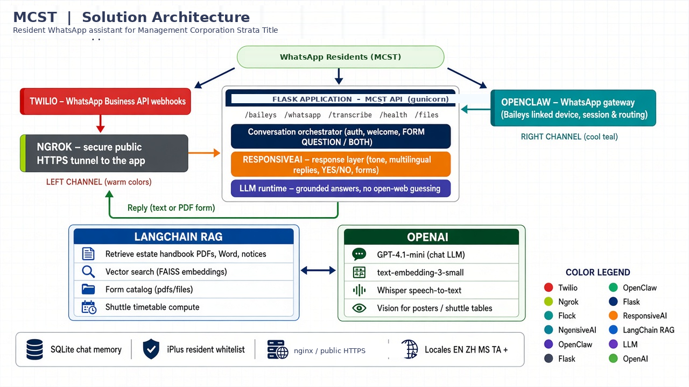
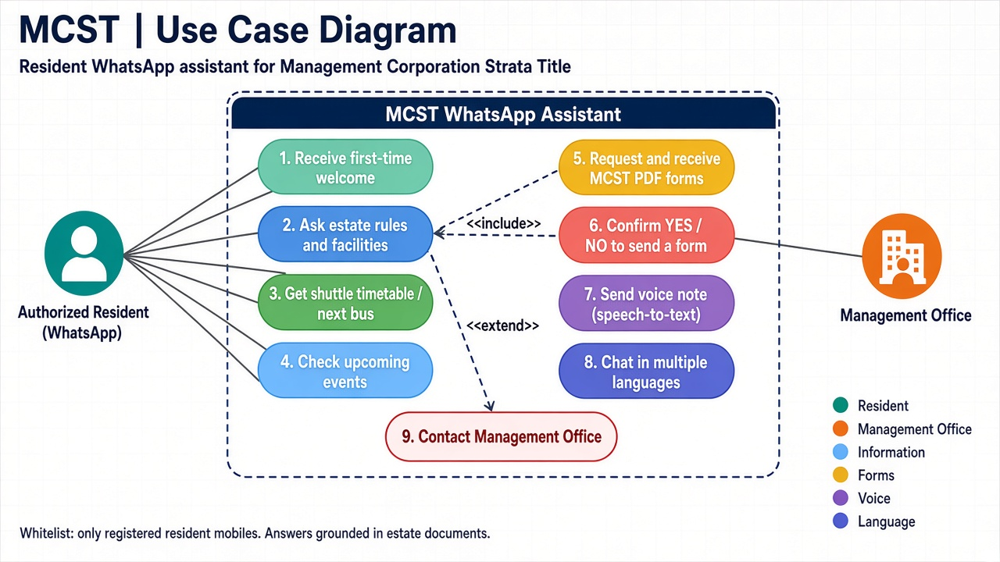

# MCST WhatsApp Assistant

A WhatsApp assistant for **Management Corporation Strata Title (MCST)** residents. Residents ask about estate rules, facilities, shuttle timings, events, and downloadable PDF forms. Answers are grounded in uploaded estate documents (RAG), not the open web.

**Source code is private and available upon request.** Open an issue on this repository or message [ksandeesh](https://github.com/ksandeesh) on GitHub.

## Architecture

**Channels:** WhatsApp via OpenClaw / Baileys, optional Twilio webhooks (Ngrok in development).

**App:** Flask behind gunicorn, with a LangChain RAG + FAISS retrieval layer.

**AI:** OpenAI for chat, embeddings, Whisper, and vision.

**Data:** SQLite chat memory, a local phone whitelist, and multilingual reply copy (EN, ZH, MS, TA, and others).

Resident data, API keys, WhatsApp sessions, and the document library are not published.
